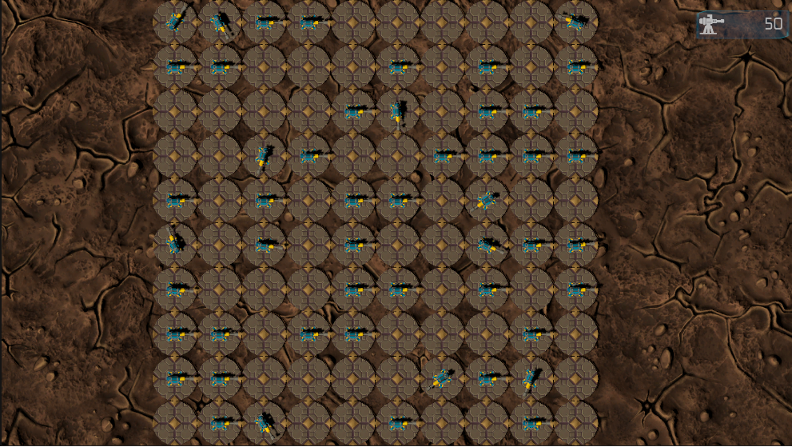

# Turret Shooting

## General Description
Project created with usage of ECS as a part of learning Unity DOTS.   
Player selects number of turrets, that will spawn on the arena.
The Arena size varies based on selected level. 
Turrets spawn on random available field.
Every turret rotates by random angle value (0-360 degrees) after random passed time (0-1 s).
Every second turrets shoot projectiles.
Turrets have 3 lives. When projectile hit the turret, number of it lives decreases.
If turret has remaining lives, it disappear from the arena and 2 seconds later come back in randomly selected free field.
Game lasts till only 1 or 0 turrets are alive.
Player then can select level again.

## Main Systems
Project contains many systems, most of them were developed with ECS and are properly noted.
Main developed systems:
- Scene management based on active scene
- Arena creation based on selected number of turrets (ECS)
- Turret spawn in randomly selected available field (ECS)
- Turret rotation after given amount of time (ECS)
- Turret shooting after given amount of time (ECS)
- Turret hit when collided with projectile (ECS)
- Projectile destruction after given amount of time or after collision with turret (ECS)
- Turret destruction after losing all lives (ECS)
- Game Over when only 1 or less turrets are alive

## Presentation Movie
For the purpose of movie, game over appears when there are 10 turrets left.
### [Movie](https://drive.google.com/drive/folders/1P6sO80JOeFV8jrTjjwgtTlDLciK4dszA?usp=sharing)

## Screenshots
 
  
## Contact
- Email: [bartosz.pokorski67@gmail.com](mailto:bartosz.pokorski67@gmail.com)
